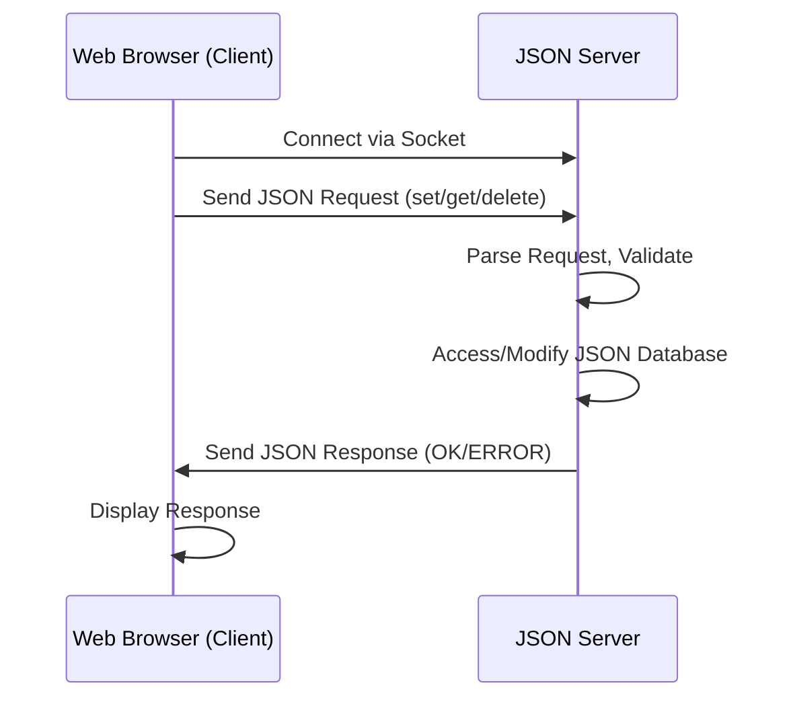

**Project Link:** [GitHub Repository](YOUR_GITHUB_LINK_HERE)

---

## Project Overview

I have developed a Java-based client-server application that enables users to store data on the server in JSON format. The server exchanges data with a web browser (client) and handles multiple requests.

---

## Client-Server Interaction Diagram

## Web-Browser (Client)

### Features
- Connects to the server and can send three primary requests: `set`, `get`, and `delete`.
- Requests can be sent through command-line arguments or read from a JSON file.
- Requests are formatted as JSON and sent to the server.

### Topics Used
- **Smart Command-Line Parsing**: Using JCommander and a custom `TypeConverter`. Attempts JSON parsing first and falls back to `JsonPrimitive` if the input is a plain string.
- **Gson Library**: To serialize objects. `JsonElement` is used for keys and values for flexibility.
- **Strategy Pattern**: For JSON preparation (`PrepareFromFile` and `PrepareFromCommandLine`) with the ability to add more preparation methods without changing the code structure.
- **Factory Pattern**: Selects the appropriate strategy based on input type.
- **Socket Communication**: `DataInputStream` and `DataOutputStream` used for sending/receiving requests.
- **Error Handling**: Custom exception `ClientInputException` for input validation errors.
- **File Handling**: Prepares JSON from file.
- **Enums**: Used for type safety.

### Improvements
- **Code Logic and Structure**: 
  - Decouple request preparation and split responsibilities of `Main()`.
  - Simplify validation logic in `JsonStrategyFactory.selectStrategy()` as it mixes validation with strategy selection.
- **Error Handling and Exceptions**: 
  - Allow users to specify a file again instead of abrupt termination.
  - Log a warning when `TypeConverter` falls back to treating input as a plain string.
  - Add read/write timeouts to prevent socket blocking.
- **Deployment Considerations**: 
  - Remove hard-coded paths (read from a config file instead).
- **Scalability**: 
  - Currently, the client handles requests sequentially. Using asynchronous I/O or threads would allow multiple requests to be sent concurrently.

---

## Server

### Features
- Handles `get`, `set`, and `delete` operations.
- Serves multiple clients simultaneously using `ExecutorService`.
- Uses a local JSON database to handle client requests.
- Can access and modify nested JSON values using keys in the form of JSON arrays and create root JSON objects when setting new values. Also deletes nested JSON objects without affecting their parent objects.

### Topics Used
- **Networking**: `ServerSocket` and `Socket` for TCP communication. Server shuts down when an `exit` request is received.
- **Concurrency**: Uses `ExecutorService` for thread pooling instead of creating a new thread for every client.
- **ReentrantReadWriteLock**: Allows multiple simultaneous readers when accessing the JSON database, but ensures one writer at a time.
- **Encapsulation**: Requests and responses are encapsulated in objects. Supports nested keys using `JsonArray` to traverse a JSON object.
- **Robustness**: Handles broken requests from clients with appropriate messages.

### Improvements
- **Code Logic and Structure**:
  - `getFromFile`, `setToFile`, and `deleteFromFile` are complex in handling nested JSONs and could be simplified.
  - `ServerSocket` shutdown works but threads may still be active; consider using `executor.shutdown()`.
- **Error Handling and Exceptions**:
  - Exception messages are generic; logging the cause should be considered.
  - Server continues on some errors
  - Retry file persistence instead of immediately throwing an exception.
- **Deployment Considerations**:
  - Thread pool size could be configurable based on server resources.
  - Consider the efficiency of `DataInputStream` for handling many clients.
  - Writing to disk for every `set/delete` may be slow in production; batch writes could improve performance.
- **Scalability**:
  - Adding new request types currently requires modifying the `switch` in `handleClient`; the Command pattern could improve extensibility.
  - Database abstraction is limited to a local JSON file; it could be extended to support other storage backends (e.g., SQLite).

---
